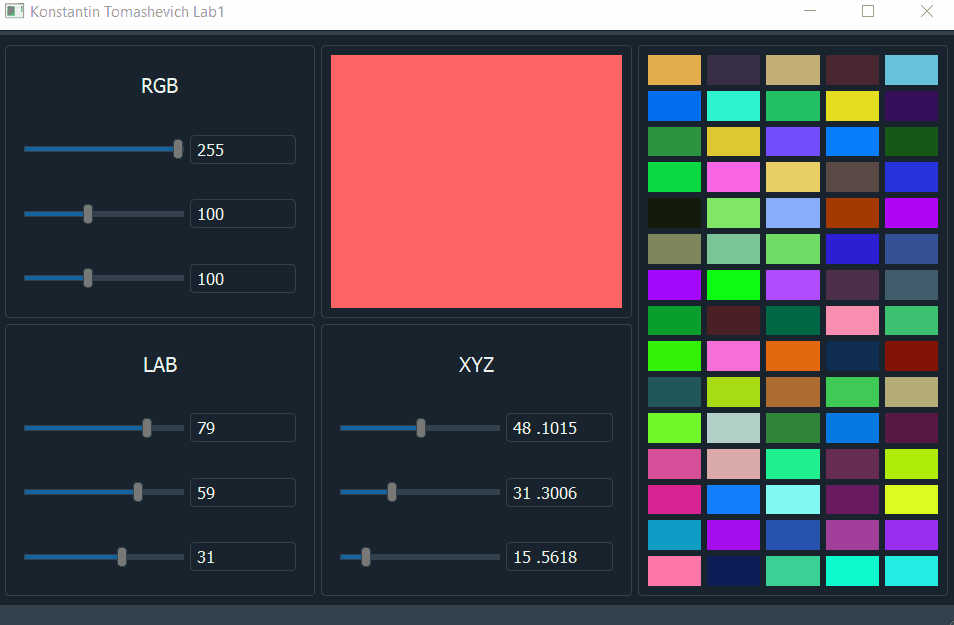
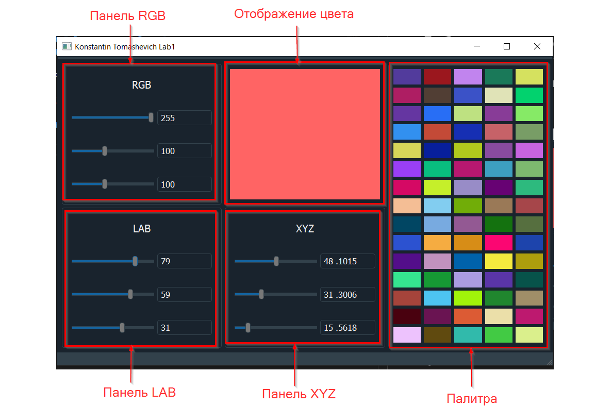
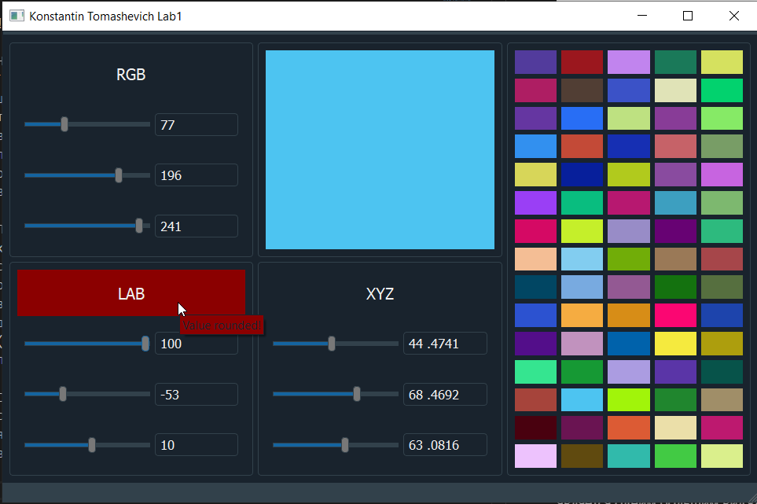

# Лабараторная работа 1
## Томашевич Константин
### Вариант 3, RGB <-> XYZ <-> LAB.

Реализовано на языке `C++` с помощью библиотеки `QT 5.15` .

## Руководство

На панелях цветовых систем (`Панель RGB`, `Панель LAB`, `Панель XYZ`) можно редактировать значение цвета в цветовой системе с помощью ползунков или ввода в текстовые поля, в которых отображаются значения. При вводе в текстовое поле нужно нажать `enter` для применения введённого значения. При изменении цвета в одной из систем автоматически производится пересчёт цвета в других системах.

По центру сверху находится панель `Отображение цвета`, которая является одним большим виджетом, цвет которого совпадает с выбранным на панели `RGB` цветом. Это ограничение сделано из-за того что `QT` поддерживает задание цвета только в `RGB`. Если мы редактируем цвет в другой системе, его значение будет сконвертировано в `RGB` (как написано в первом абзаце) и уже тогда применено к панели.

Справа находится палитра. Цвета в палитре генерируются случайным образом при запуске программы. При клике на ячейку палитры цвет ячейки применяется и переводится во все цветовые системы.

Если при конвертации из одной цветовой системы в другую пришлось округлить результат, название цветовой системы будет выделено красным и при наведении будет выводится подсказка, сообщающая о том, что значение было округлено.

