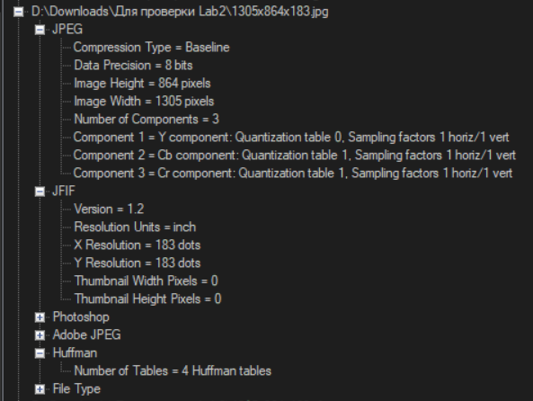
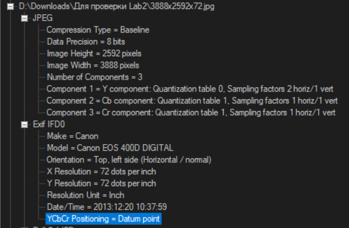
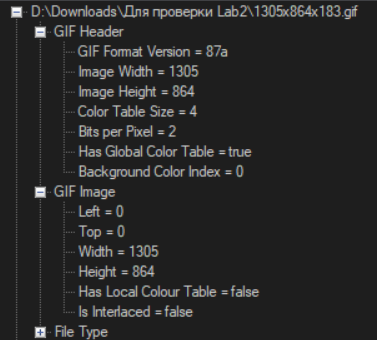
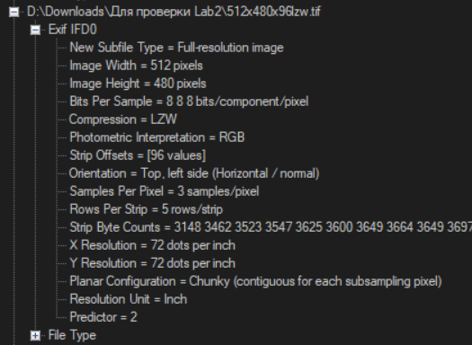
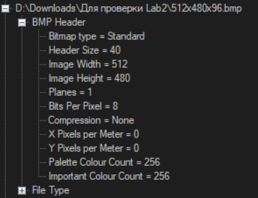
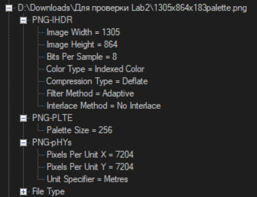
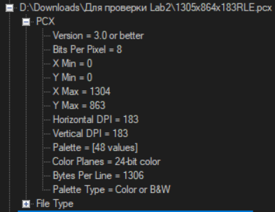

# Лабараторная работа 2
## Томашевич Константин

Видео работы с приложением: сначала загрузка проверочной папки, потом загрузка папки размером 2.01ГБ с 1512 файлами с SSD-диска.

Приложение было реализовано на `C#` с использованием `Windows Forms`.

## Как читается информация?

Для чтения информации была использована библиотека [Metadata Extractor](https://drewnoakes.com/code/exif/), позволяющая доставать достаточно быстро множество информации из различных форматов изображений. Для ускорения обработки был использован встроенный `task`-фреймворк `C#`, с помощью которого чтение каждого изображения выделялось как отдельное задание для паралельной обработки.

## Как выводится информация?

Информация выводится в виде дерева: на основном уровне находятся имена файлов, а дети узлов с имёнами файлов -- директории отчёта `Metadata Extractor`а. Ниже опишу где находится основная информация про изображение для каждого типа файлов.

### JPG 

* Размер изображения в пикселях -- `JPEG/Image Height` и `JPEG/Image Width`.
* Разрешение -- `JFIF/X Resolution` и `JFIF/Y Resolution` или `EXIF IFD0/X Resolution` и `EXIF IFD0/Y Resolution` (в зависимости от того какой тип метаинформации был записан в изображение).

* Глубина цвета -- `JPEG/Data Precision`.
* Сжатие -- `JPEG/Compression Type`, `EXIF IFD0/YCbCr Positioning`, `Huffman/Number Of Tables`.

### GIF

* Размер изображения в пикселях -- `GIF/Image Height` и `GIF/Image Width`.
* Разрешение -- отсутствует.
* Глубина цвета -- `GIF/Color Table Size` (количество цветов в таблице) и `GIF/Bits Per Pixel` (количество битов на один пиксель).
* Сжатие -- отсутствует.

### TIF

* Размер изображения в пикселях -- `EXIF IFD0/Image Height` и `EXIF IFD0/Image Width`.
* Разрешение -- `EXIF IFD0/X Resolution` и `EXIF IFD0/Y Resolution`.
* Глубина цвета -- `EXIF IFD0/Bits Per Sample` и `EXIF IFD0/Samples Per Pixel`.
* Сжатие -- `EXIF IFD0/Compression`.

### BMP

* Размер изображения в пикселях -- `BMP Header/Image Height` и `BMP Header/Image Width`.
* Разрешение -- отсутствует.
* Глубина цвета -- `BMP Header/Bits Per Pixel`, `BMP Header/Palette Colour Count`, `BMP Header/Important Palette Colour Count`.
* Сжатие -- `BMP Header/Compression`.

### PNG

* Размер изображения в пикселях -- `PNG-IHDR/Image Height` и `PNG-IHDR/Image Width`.
* Разрешение -- `PNG-pHYs/Unit Specifier`, `PNG-pHYs/Pixels Per Unit X`, `PNG-pHYs/Pixels Per Unit Y`.
* Глубина цвета -- `PNG-IHDR/Bits Per Sample`, `PNG-IHDR/Color Type`, `PNG-PLTE/Palette Size`.
* Сжатие -- `PNG-IHDR/Compression Type`.

### PCX

* Размер изображения в пикселях -- `PCX/X Min` и `PCX/X Max`, `PCX/Y Min` и `PCX/Y Max`.
* Разрешение -- `PCX/Horizontal DPI`, `PCX/Vertical DPI`.
* Глубина цвета -- `PCX/Bits Per Pixel`, `PCX/Color Planes`, `PCX/Palette`.
* Сжатие -- библиотека не смогла определить тип сжатия.