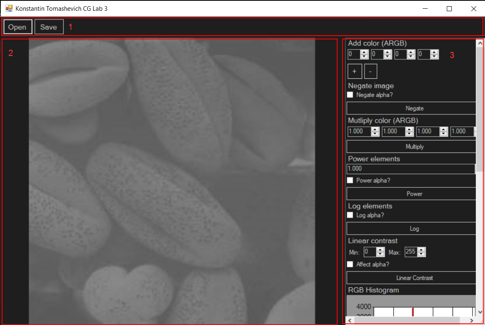
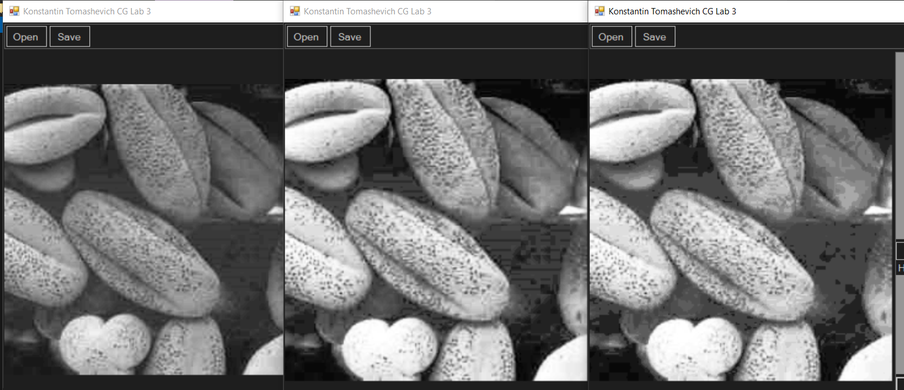
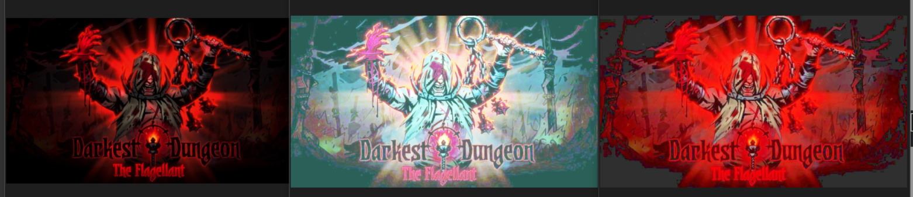
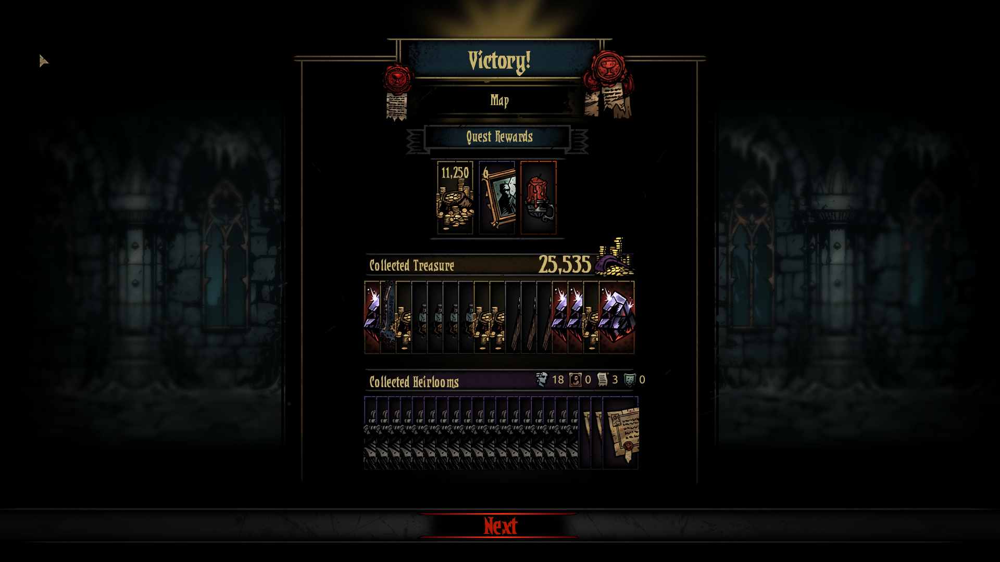
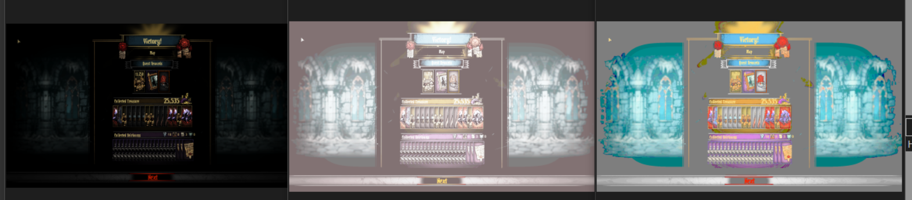

# Лабараторная работа 3
## Томашевич Константин
### Вариант 1

Видео работы с приложением:

Приложение было реализовано на `C#` с использованием `Windows Forms`.

## Описание графического интерфейса

1. Верхняя панель -- содержит кнопки для загрузки изображения с диска и для сохранения изображения на диск.
2. Панель показа изображения. Показывает редактируемое изображение.
3. Панель инструментов. Содержит все нужные по варианту инструменты. Их довольно много, поэтому панель прокручивается.

Список реализованных инструментов по порядку:

* Аддитивное прибавление (или вычитание) цвета. Нужно ввести значения ARGB компонентов, которые будут прибавлены (или вычтены при клике на кнопку вычета) ко всем пикселям изображения.
* Преобразование негатива для всех пикселей изображения. При желании отнегативить можно и компонент прозрачности.
* Преобразования возведения всех пикселей изображение во введённую пользователем степень. При желании можно возвести в степень и компонент прозрачности.
* Преобразование применения логарифма ко всем пикселям изображения. При желании может быть применено также к компоненту прозрачности.
* Преобразование линейного контрастирования. Пользователь вводит целевые минимум и максимум, а также указывает нужно ли учитывать компонент прозрачности. После этого fmin и fmax ищутся среди значений всех компонентов (исключая прозрачность, если пользователь не указал этого). После их нахождения применяется преобразование линейного контрастирования. Линейное контрастирование не применяется к каждому компоненту по отдельности чтобы избежать искажения соотношений цветов.
* Гистограмы RGB-компонентов и эквализация по ним. Показываются гистограммы всех компонентов и пользователь может дать программе команду провести эквализацию по каждому компоненту отдельно.
* Гистограмма яркости HSV. Показывается шистограмма яркости HSV и пользователь может дать программе команду провести эквализацию по этой компоненте.

## Комментарии относительно методов контрастирования
### Теоретические замечания

На мой взгляд основная проблема метода линейного контрастирования в выборе границ (fmin/fmax), так как появление нескольких ярких пикселей может не дать методу провести констрастирование остальных тёмных пикселей. Эту проблему можно решить статистическим отбросом "редких" границ, но при этом частично потеряется качество изображение.

Выравнивание гистограмм RGB-компонентов по отдельности имеет более явную проблему -- при использовании на не являющихся монотонными изображениях с большой вероятностью произойдёт искажение соотношений цветов, что не очень хорошо.

Выравнивание по гистограмме яркости HSV выглядит наиболее действенным методом, так как оно в большинстве случаев не приводит к искажению цветов и не требует дополнительных параметров вроде статистической точности границы fmin/fmax.

### Практические примеры

Исходное изображение:

Результаты обработки (слева направо -- линейное контрастирование, выравнивание гистограммы по каждому компоненту по отдельности, выравнивание гистограммы по яркости):

На монотонном изображении все методы справились почти одинаково хорошо, но результаты работы выравниваний по гистограммам выглядят субъективно ярче.

Исходное изображение:

Результаты обработки (слева направо -- линейное контрастирование, выравнивание гистограммы по каждому компоненту по отдельности, выравнивание гистограммы по яркости ):

Линейное контрастирование в данном случае вообще не сработало из-за наличия яркого красного и абсолютно чёрного фона (то есть и так fmin = 0 и fmax = 255),

Выравнивание гистограммы по каждому компоненту по отдельности привело к ожидаемому результату -- цвета серъёзно искажены. Выглядит оно, конечно, прикольно, но цветовую схему реального изображения не передаёт.

Выравнивание гистограммы по яркости HSV дало довольно хороший результат, повысив яркость и сохранив тональность исходного изображения.

Исходное изображение:

Результаты обработки (слева направо -- линейное контрастирование, выравнивание гистограммы по каждому компоненту по отдельности, выравнивание гистограммы по яркости):

Линейное контрастирование также не сработало. В данном случае можно было бы применить метод статического среза максимума, но это чувствительно испортило бы вид ярких элементов в центре.

Выравнивание гистограммы по каждому компоненту по отдельности также привело к искажению цветов. Вдобавок к этому из-за наличия множества чёрных элементов остальные элементы стали слишком блеклыми и светлыми.

Выравнивание гистограммы по яркости HSV сохранило цвета и тональность, что довольно хорошо. Но из-за специфики работы выравнивания по гистограмме переход из тёмных элементов в светлые стал слишком резким и неприятным. В таком случае могло бы помочь линейное контрастирование, но оно в свою очередь испортило бы "излишне" яркие элементы.

### Вывод

Из рассмотренных методов наилучшим является выравнивание гистограммы яркости HSV, но у него также есть некоторые недостатки.
