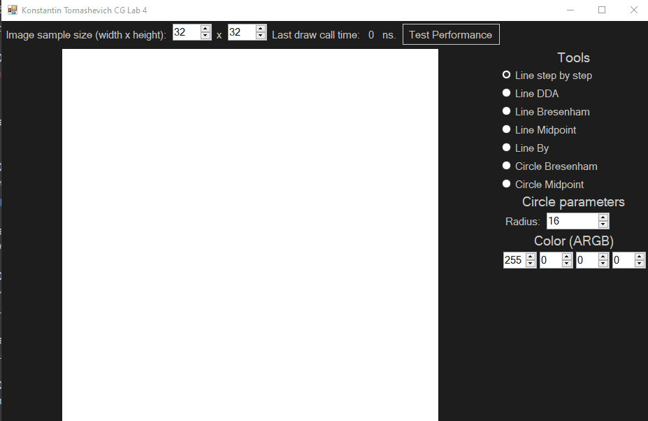

# Лабараторная работа 4
## Томашевич Константин

Видео работы с приложением:



Приложение было реализовано на `C#` с использованием `Windows Forms`.

## Краткое описание

С помощью приложения можно рисовать на холсте с изменяемыми размерами (от 16х16 до 4096х4096) следующими инструментами рисования:

* Простое пошаговое рисование линии.
* Рисование линии с помощью алгоритма DDA.
* Рисование линии с помощью алгоритма Брезенхема.
* Рисование линии с помощью алгоритма Кастла-Питвея.
* Рисование сглаженной линии с помощью алгоритма By.
* Рисование окружности по алгоритму Брезенхема.
* Рисование окружности по алгоритму Кастла-Питвея.

При изменении размера холста в большую сторону дополнительные правые и нижние пиксели заполняются белым цветом. При изменении размера холста в меньшую сторону обрезаются правые и нижние краевые пиксели.

## Тестирование производительности

Для тестирования скорости работы была добавлена кнопка `Test Performance`, которая следующим образом тестирует выбранный инструмент:

* Если инструмент рисует линию, 1000 раз рисуем линию из верхнего левого в правый нижний край. В поле `Last draw call time` выводим среднее значение времени отрисовки за 1000 запусков.
* Если инструмент рисует линию, 1000 раз рисуем окружность с центром в центре холста и радиусом равным половине ширины или высоты (выбираем наименьшее из двух). В поле `Last draw call time` выводим среднее значение времени отрисовки за 1000 запусков.

Для прямых были получены следующие результаты на холсте 4096х4096:

* Простое пошаговое -- 1485 нс.
* DDA -- 1445 нс.
* Брезенхем -- 1379 нс.
* Кастл-Питвей -- 1376 нс.
* By -- 5142 нс.

Вывод: использование только целочисленных операций в алгоритмах Брезенхема и Кастла-Питвея позволило сэкономить немного времени в сравнении с DDA и пошаговым алгоритмами. Алгоритм By работает довольно медленно, но это из-за того что он по факту решает другую задачу -- построение **сглаженной** линии.

Для окружностей были получены следующие результаты на холсте 4096х4096:

* Брезенхем -- 4189 нс.
* Кастл-Питвей -- 4054 нс.

## Рассчёты для DDA

Нарисуем линию из (5, 7) в (9, 10) по алгоритму DDA.

```

dx = 4
dy = 3
length = 4 -- количество пикселей после первого

sx = 1 -- шаг по Х
sy = 0.75 -- шаг по У

# Начальный пиксель -- t = 0
x = round(5 + sx * t) = 5
y = round(7 + sy * t) = 7

# t = 1
x = round(5 + sx * t) = 6
y = round(7 + sy * t) = round(7.75) = 8

# t = 2
x = round(5 + sx * t) = 7
y = round(7 + sy * t) = round(8.5) = 9

# t = 3
x = round(5 + sx * t) = 8
y = round(7 + sy * t) = round(9.25) = 9

# Конечный пиксель t = 4
x = round(5 + sx * t) = 9
y = round(7 + sy * t) = 10

```