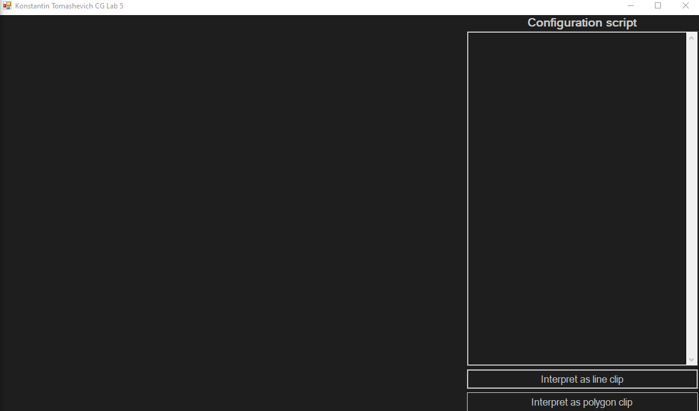
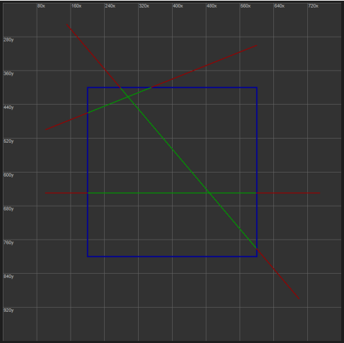
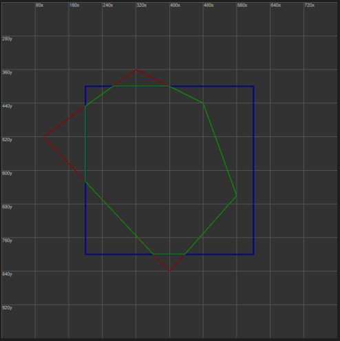
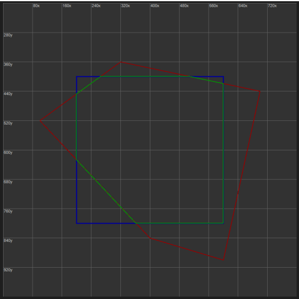
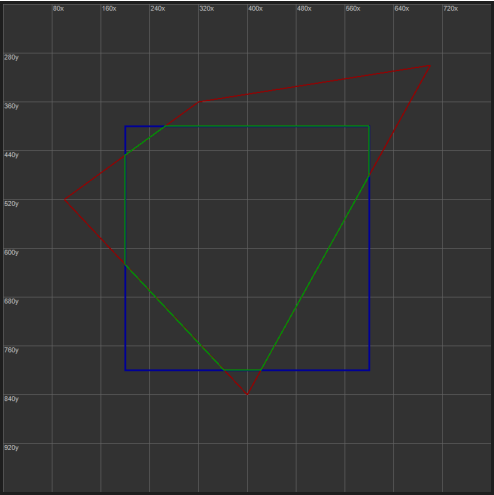
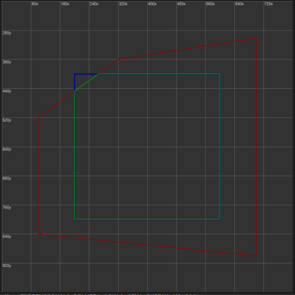
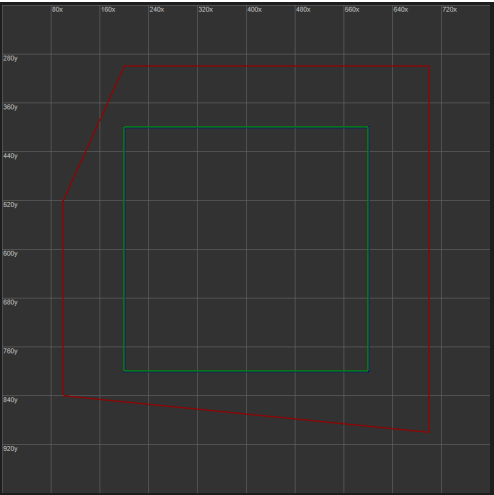

# Лабараторная работа 5
## Томашевич Константин
### Вариант 21

Видео работы с приложением:



Приложение было реализовано на `C#` с использованием `Windows Forms`.

## Краткое описание

В правой части окна приложения находится поле для ввода данных. Под этим полем находятся кнопки `Interpret as line clip` и `Interpret as polygon clip`, отвечающие за интерпретацию введёных данных как скрипта визуализации отсечения отрезков или скрипта визуализации отсечения выпуклого многоугольника соответственно.

Скрипт отсечения отрезков должен иметь следующий формат:
```
line1X0 line1Y0 line1X1 line1Y1
...
lineNX0 lineNY0 lineNX1 lineNY1
clippingRectX0 clippingRectY0 clippingRectX1 clippingRectY1
```

Скрипт отсечения выпуклого многоугольника должен иметь следующий формат:
```
point1X point1Y
...
pointNX pointNY
clippingRectX0 clippingRectY0 clippingRectX1 clippingRectY1
```

После выполнения скрипта происходит визуализация отсечения:

* Светлосерым цветом рисуется сетка, подписи к ней рисуются белыми цифрами в верхней и левой частях иллюстрирующего изображения.
* Синим отрисовывается отсекающий прямоугольник.
* Красным рисуются изначальные отрезки или изначальный многоугольник.
* Зелёным рисуются отсечённые отрезки или отсечённый многоугольник.

### Примеры скриптов

### Отсечение отрезков

```
100 500 600 300
150 250 700 900
100 650 750 650
200 400 600 800
```

Визуализация:



### Отсечение выпуклых многоугольников

```
100 520
320 360
480 440
560 660
400 840
200 400 600 800
```

Визуализация:



```
100 520
320 360
700 440
600 900
400 840
200 400 600 800
```

Визуализация:



```
100 520
320 360
700 300
400 840
200 400 600 800
```

Визуализация:



```
100 520
320 360
700 300
700 900
100 840
200 400 600 800
```

Визуализация:



```
100 520
200 300
700 300
700 900
100 840
200 400 600 800
```

Визуализация:

