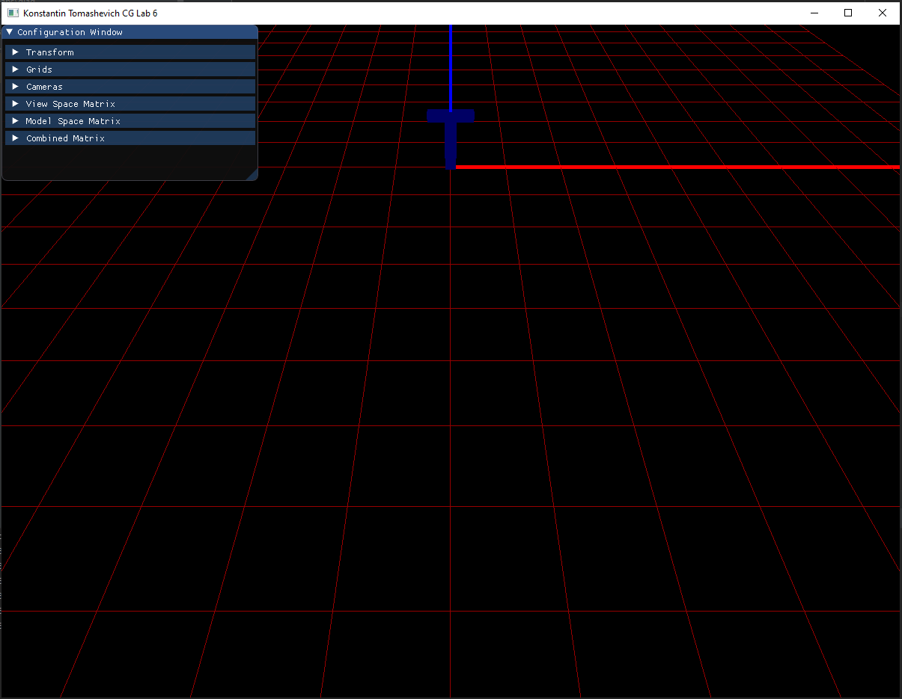
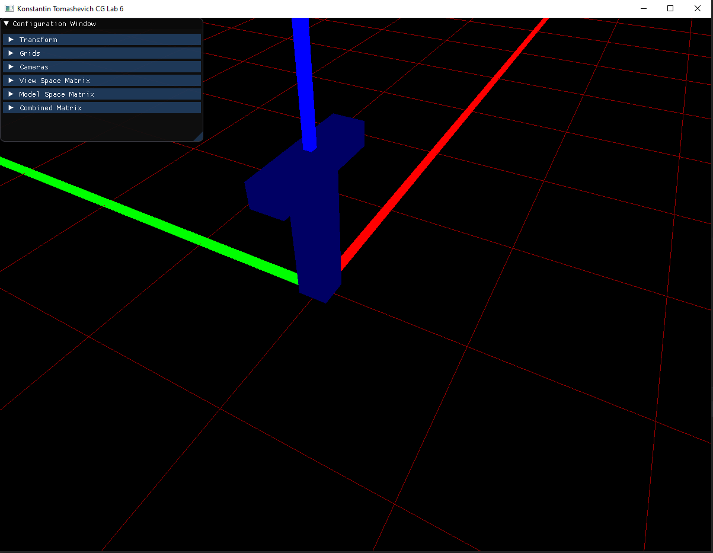
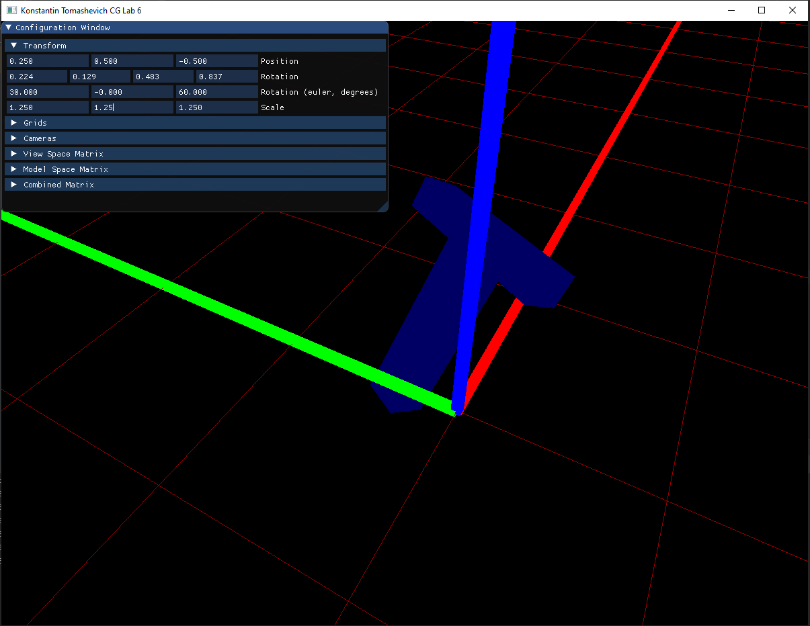
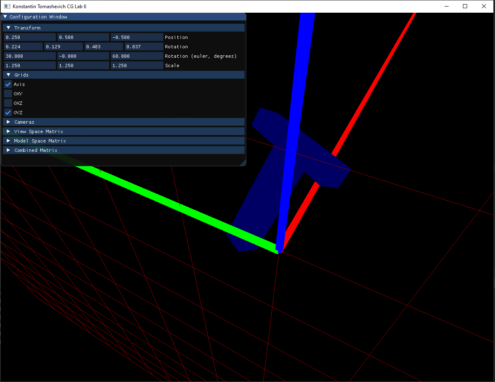
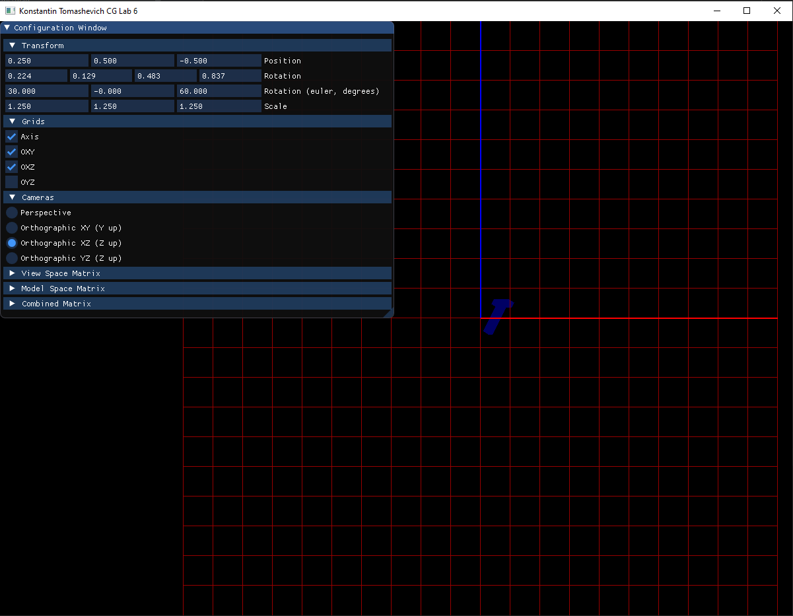
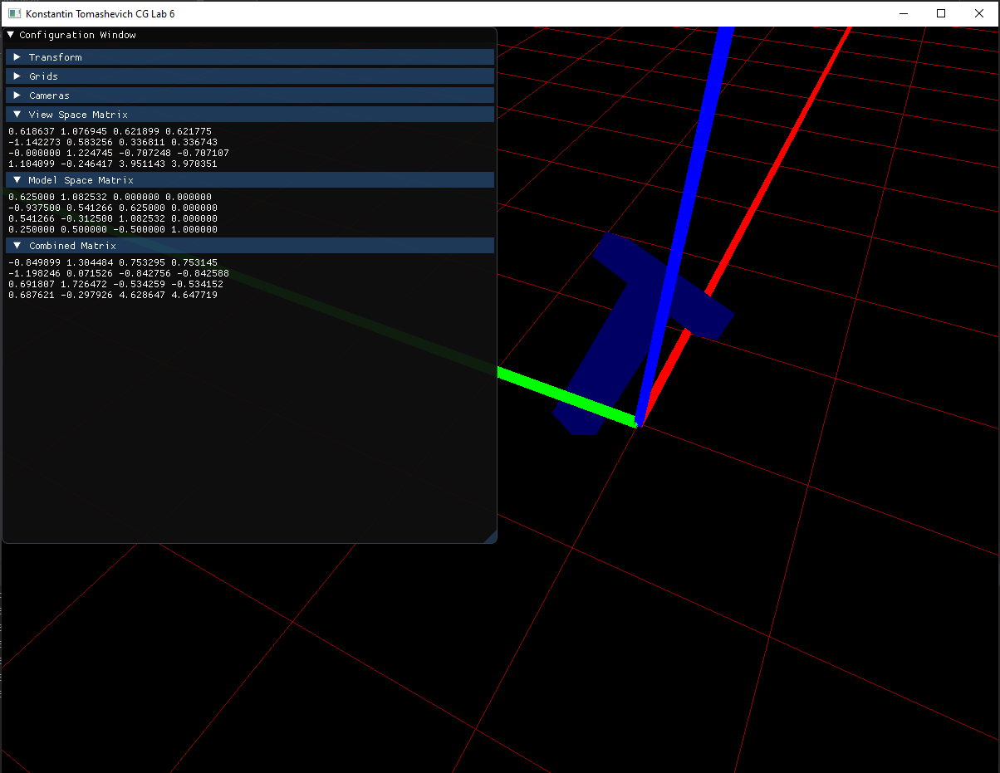

# Лабораторная работа 6
## Томашевич Константин
### Вариант `T`

Видео работы с приложением:

Приложение было реализовано на `C++` с использованием следующих библиотек:

* [GLFW](https://www.glfw.org/) -- использовалась для создания окна, работы с ним и получения событий ввода от операционной системы.
* [GLAD](https://github.com/Dav1dde/glad) -- использовался для генерации загрузчика для OpenGL.
* [GLM](https://glm.g-truc.net/0.9.9/index.html) -- содержит реализации используемых математических операций.
* [IMGUI](https://github.com/ocornut/imgui) -- использовалось для создания графического интерфейса.

## Описание приложения

По заданию лабораторной работы было реализовано приложение, которое отрисовывает трёхмерную букву `T`, позволяя рассматривать её из разных проекций и применять аффинные преобразования.

При запуске приложения сцена устанавливается в состояние по умолчанию:

* Буква стоит в центре координатной системы.
* Включена отрисовка сетки 20х20 на плоскости ОXY, центр сетки совпадает с центром координат.
* Включена отрисовка линий, обозначающих оси.
* Выбрана перспективная камера, наклонённая на 45 градусов по оси Х, смещённая на -10 пунктов по оси Y и на 5 пунктов по оси Z.

В левом верхнем углу создаётся окно с интерфейсом приложения, через которое можно трансформировать объект, переключать камеры и включать/выключать отрисовку сеток и осей. Это окно можно перетягивать в рамках окна приложения. Также можно изменять размер окна.

### Движение камеры

С помощью клавиатуры можно передвигать активную камеру:

* D/A -- движение в положительном/отрицательном направлении по оси X.
* W/S -- движение в положительном/отрицательном направлении по оси Y.
* E/Q -- движение в положительном/отрицательном направлении по оси Z.

Также перспективную камеру можно вращать вокруг оси Z с помощью клавиш R/T.

### Трансформация объекта

С помощью подменю `Transform` можно выполнять следующие преоборазования:

* Менять позицию буквы в координатах сцены (`Position`).
* Вращать букву путём задания вращения через углы Эйлера или через квартернион (`Rotation (euler, degrees)` и `Rotation`).
* Масштабировать букву (`Scale`).

### Включение/выключение отрисовки сеток и осей

В подменю `Grids` можно включать/выключать отрисовку следующих элементов:

* `Axis` -- жирно отрисовываемые линии положительного направления осей. Красная линия -- ось X, зелёная -- Y, синяя -- Z.
* `OXY` -- сетка 20х20 пунктов на плоскости OXY с центром в центре координатной системы.
* `OXZ` -- сетка 20х20 пунктов на плоскости OXZ с центром в центре координатной системы.
* `OYZ` -- сетка 20х20 пунктов на плоскости OYZ с центром в центре координатной системы.

### Выбор камеры

В подменю `Cameras` можно сменить текущую активную камеру. Доступны следующие камеры:

* `Perspective` -- перспективная камера с фиксированным углом поворота вокруг осей X (45 градусов) и Y (0 градусов), свободным углом поворота вокруг оси Z и свободно двигающуюся по всем осям. Ведёт себя подобно обычной RTS-камере без фиксированного Z. По умолчанию находится в координате `(0, -10, 5)`.
* `Orthographic XY (Y up)` -- ортографическая камера, использующая проекцию на плоскость XY таким образом, что ось Y направлена в вверх. Имеет высоту (ortho size) в 20 пунктов, тем самым гарантированно вмещая в себя всю сцену. По умолчанию находится в координате `(0, 0, 1)`.
* `Orthographic XZ (Z up)` -- ортографическая камера, использующая проекцию на плоскость XZ таким образом, что ось Z направлена в вверх. Имеет высоту (ortho size) в 20 пунктов, тем самым гарантированно вмещая в себя всю сцену. По умолчанию находится в координате `(0, -1, 0)`.
* `Orthographic YZ (Z up)` -- ортографическая камера, использующая проекцию на плоскость YZ таким образом, что ось Z направлена в вверх. Имеет высоту (ortho size) в 20 пунктов, тем самым гарантированно вмещая в себя всю сцену. По умолчанию находится в координате `(1, 0, 0)`.

### Просмотр матриц преобразований

Матрицы преобразований можно посмотреть с помощью следующих подменю:

* `View Space Matrix` -- матрица, помножением на которую слева можно преобразовать матрицу трансформации объекта в конечную `MVP`-матрицу, передаваемую в шейдер для отрисовки. Получается путём умножения матрицы проекции камеры на инвертированную матрицу трансформации объекта-камеры.
* `Model Space Matrix` -- матрица трансформации объекта-буквы.
* `Combined Matrix` -- результат умножения `View Space Matrix` на `Model Space Matrix`, который передаётся в шейдер для отрисовки объекта-буквы.

